# EnterpriseProject
Repo voor het project van enterprise project

## Teammembers
- Joppe Vanhelden
- Ruben Heurckmans

## Gekozen thema:
Voor dit project zijn we gegaan voor een basic restaurant review app. Hierbij kunnen gebruikers reviews achterlaten voor een restaurant. In die review kunnen ze afbeeldingen meegeven en deze worden dan ook gelinkt aan het restaurant.

## Microservices: 
- Restaurantservice:
  Service dat restaurant data bijhoudt. De data dat wordt bijgehouden is: id, restaurantCode, naam, straat, huisnummer, 
  plaats en postcode.
- Reviewservice:
  Service dat de review data bijhoudt. De data dat wordt bijgehouden is: id, reviewCode, userCode, imageCode en description
- Imageservice
  Service dat de data van de afbeeldingen bijhoudt. De data dat wordt bijgehouden is: id, imageCode, reviewCode,   
  restaurantCode en imageUrl.
  plaats en postcode.
- Userservice:
  Service dat user data bijhoudt. De data dat wordt bijgehouden is: id, userCode, naam, voornaam, straat, huisnummer, 
  plaats en postcode.

## Gateways:
- Onze lokale services draaien op volgende poorten:
    - review-service: localhost:8082
    - image-service: localhost:8084
    - restaurant-service: localhost:8081
    - user-service: localhost:8083
- En onze services komen terecht op de volgende endpoint op onze gateway:
    - review-service: localhost:8085/review/**
    - image-service: localhost:8085/image/**
    - restaurant-service: localhost:8085/restaurant/**
    - user-service: localhost:8085/user/**

## Schema:
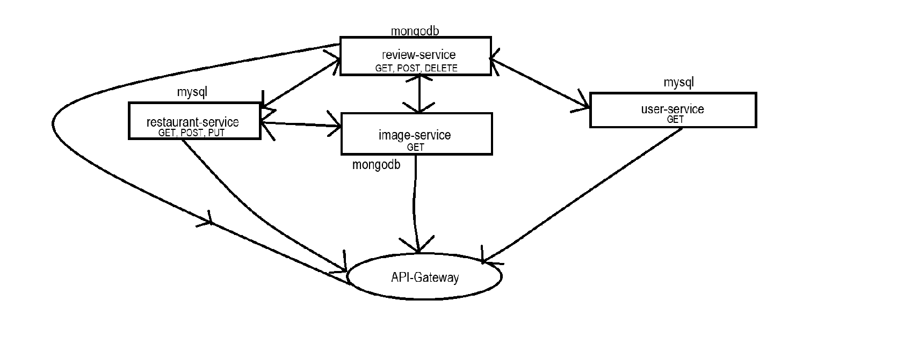

## Screenshots endpoints:

### User
user/get/all -> lijst van alle users
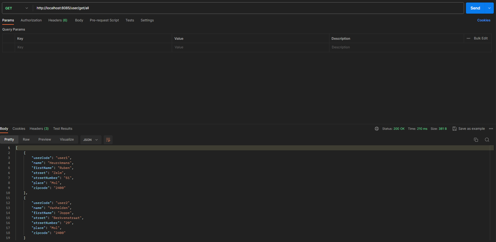

user/get/user1 -> data van user1
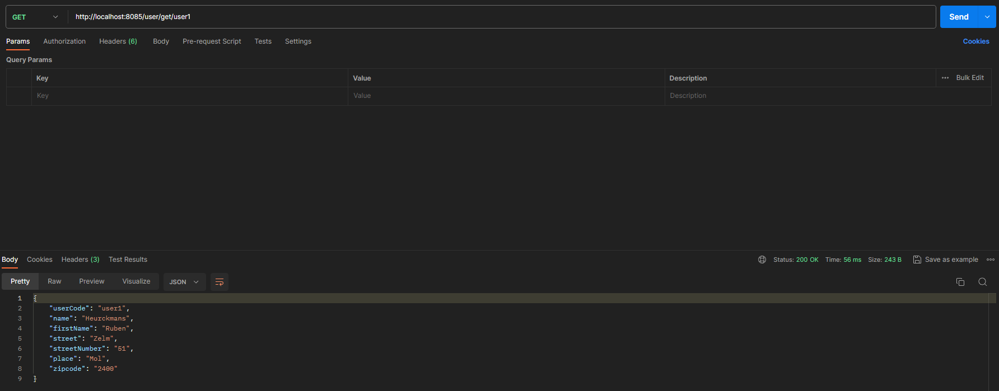

### Review
review/get/all -> lijst van alle reviews
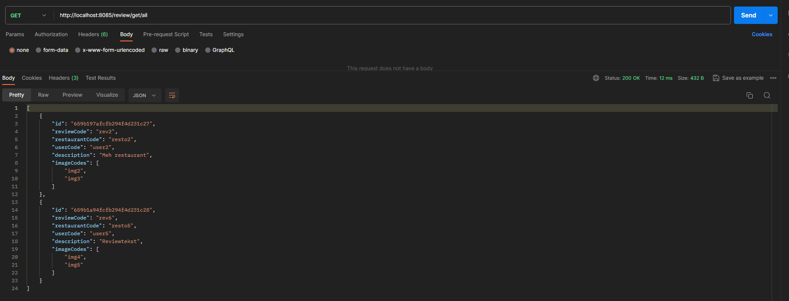

review/get/rev1 -> data van rev1
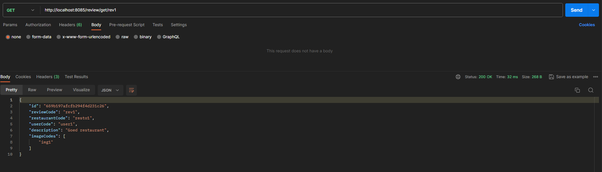

review/add -> toevoegen van review
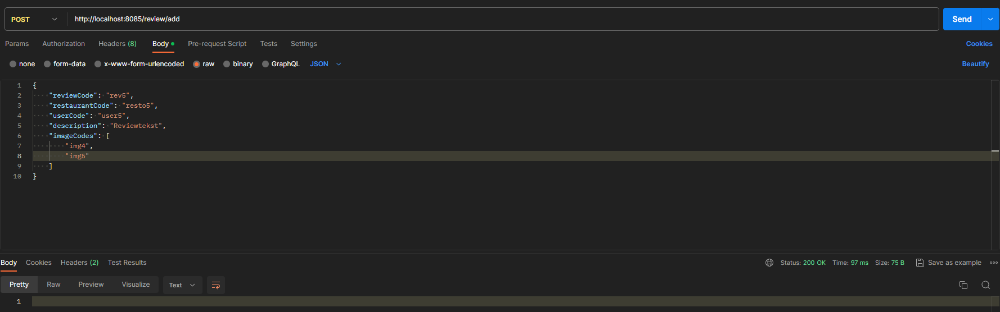

review/get/all -> lijst van alle reviews na toevoegen rev5
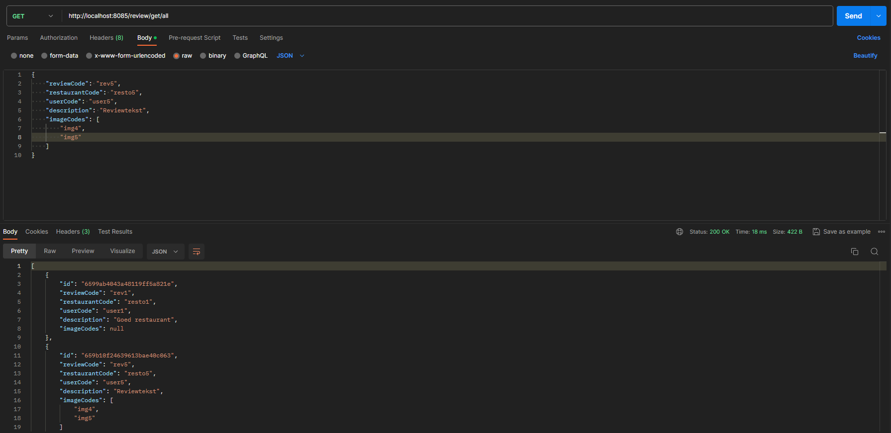

review/delete/rev1 -> deleten van rev1
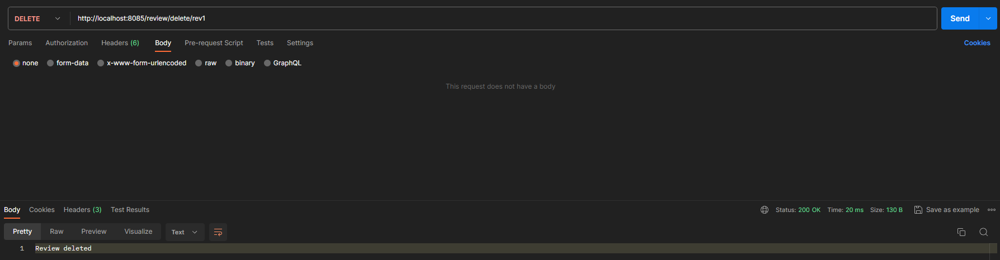

review/get/all -> lijst van alle reviews na delete rev1
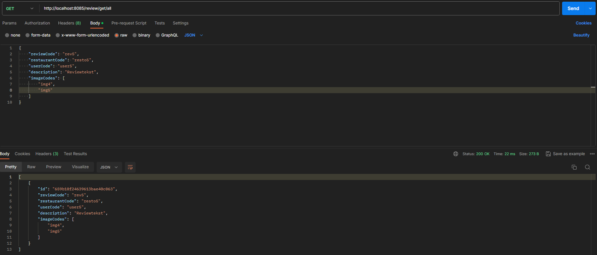

### Image

image/get/all -> lijst van alle images
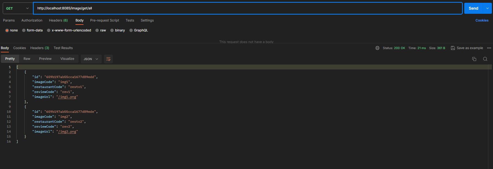

image/get/img1 -> data van img1
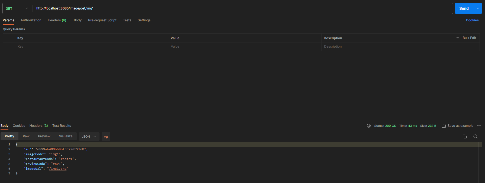

### Restaurant

restaurant/add -> toevoegen van restaurant
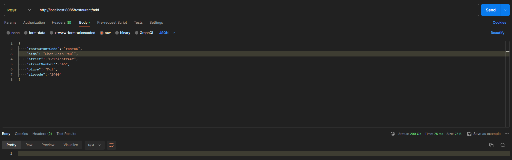

restaurant/get/all -> lijst van alle restaurants
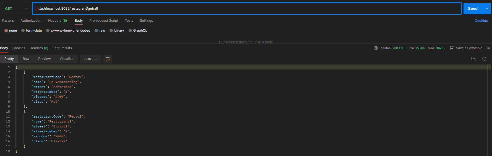

restaurant/update/resto5 -> data van img1

